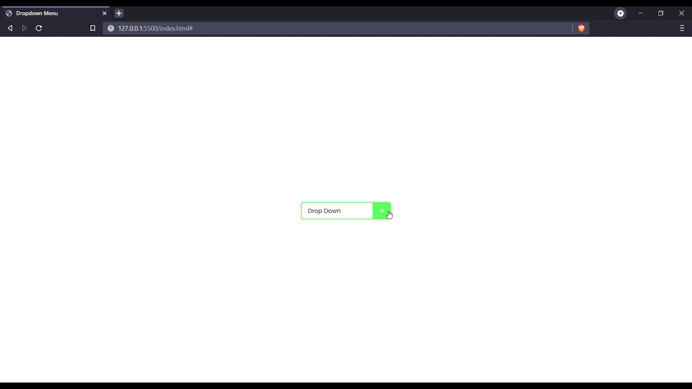

# Menu Dropdown com HTML e CSS



## Sobre

Nesse projeto a ideia foi fazer algo simples, mas que pudesse trabalhar o uso do HTML e principalmente <br>
o CSS com uso de alguns pseudo-elementos como `after` e `before`.

## Clonando e executando

Após clonar o projeto em sua máquina local: <br>

```
$ git clone https://github.com/ecthon/dropdown-menu
```

Você irá precisar compilar o arquivo `style.scss` para gerar o arquivo css com a estilização do projeto.
Nesse projeto em específico estou utilizando a extensão [Live Sass Compiler](https://marketplace.visualstudio.com/items?itemName=ritwickdey.live-sass) do [VSCode](https://code.visualstudio.com/download) para para esse processo.

Feito isso, você pode utilizar o [Live Server](https://marketplace.visualstudio.com/items?itemName=ritwickdey.LiveServer) para ver o projeto em seu browser.

Feito com uma dose ☕ e 💚 por [ecthon](https://github.com/ecthon).
